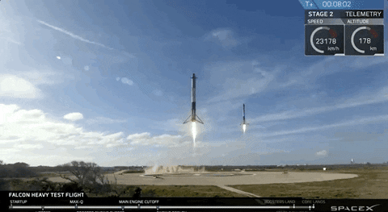

# Winning Space Race with Data Science
### by Alejandra Ramos 
#### Final assignment of the course "IBM Data Science Professional Certificate" 

## Executive Summary 
* [Introduction](#introduction) 
* [Methodology](#Methodology)
* [Results](#results)
* [Conclusion](#conclusions)
* Appendix

## Introduction

Over the years private companies have taken an interest in making space travel accessible to all, SpaceX has been one of the companies with more recognition in this subject, since its foundation in 2002, having achieved great success with their use of a "two stage rocket", which as the name imply are space vehicles that use two separate stages that provide propulsion consecutively to achieve orbital velocity, Space X can reduce the cost of each rocket from 165 million (from other suppliers) to 62 million thanks to this recovery of the first stage, which is the most expensive stage. For this project we will using data science to work for a new rocket company: Space Y founded by Allon Musk, we gather the information about Space X and determine if the first stage will land successfully and the characteristics for it to see how one can replicate the achievement from Space X. 

## Methodology 
* Data collection methodology

The data resources are identified and gathered from the SPACEX API and the SPACEX Wiki page. For both cases we uses the function .get() to extract the content of the link to a variable, that later we will “clean”: remove the duplicates, review the data format, delete/replace the missing data and the invalid values. After that, we will filter the information that we require, in this case only the data from the Falcon 9, and finally, all the relevant information will be save in a data frame.

* Perform data wrangling
* Perform exploratory data analysis (EDA) using visualization and SQL
* Perform interactive visual analytics using Folium and Plotly Dash
* Perform predictive analysis using classification models

## Results
* In the VAFB-SLC launch site there are no rockets launched for heavy payload mass(greater than 10000).
* The highest success rate are for the ES-L1, GEO, HEO, SSO and VLEO orbits.
* We only have the orbit type PO and SSO in the launch site VAFB SLC 4E.
* We only have the orbit type LEO, ISS, GTO, VLEO and SO in the launch site KSC LC 39A.
* The site with the highest success rate is KSC LC-39A.
* The only booster version with the Payload between 5000 and 10000 kg are the FT and the B4
* The B4 booster version is the booster with the highest payload. 
* The booster with the highest success rate is the Booster F9 FT (Falcon 9 Full Thrust) 

## Conclusions
* The booster with highest success rate is the Booster F9 FT (Falcon 9 Full Thrust) was used for the first 
time in December 2015 (the year in which the success rate of the missions started to increase 
considerably) with this booster more than 100 successful launches have been performed. 
* The launch sites should be far distant from highly populated areas such as cities, preferably near the 
coast, where it is possible to perform two types of landings for the recovery of the booster (on land or at 
sea), being the second one the one with better results based on the data obtained. 
* The relationship between booster weight, orbit type and mission effectiveness should be emphasized, for 
example, for PO orbit, the successful missions were those where boosters weighing more than 8000 Kg 
were used, thus increasing considerably the cost, unlike in the case of other orbits such as HEO, 
GEO or LEO which have a higher success rate using smaller boosters (less than 8000 Kg). But 
the type of orbit also varies the possible launch site to choose for each mission, according to the results 
obtained, it can be observed that in the VAFB SLC 4E site were performed only launches for PO and ISS 
orbits, while in the KSC LC 39A (which is the most successful launch site among all) 
were performed launches for LEO, ISS, GTO, VLEO and SO orbits.
* It is important to highlight the consequences of using different databases for different studies, for 
example, the dataset with more values resulted in the VAFB SLC site having a success rate of 77% in contrast to the second one with less values which resulted in a success rate of 40%.
* Considering the mentioned points, Space Y first endeavor should focus on launches using a booster with 
similar specs as the F9 FT Booster, from a site with resources and conditions like the KSC LC39A and 
centered in orbits like LEO to increase the potential profit. 
